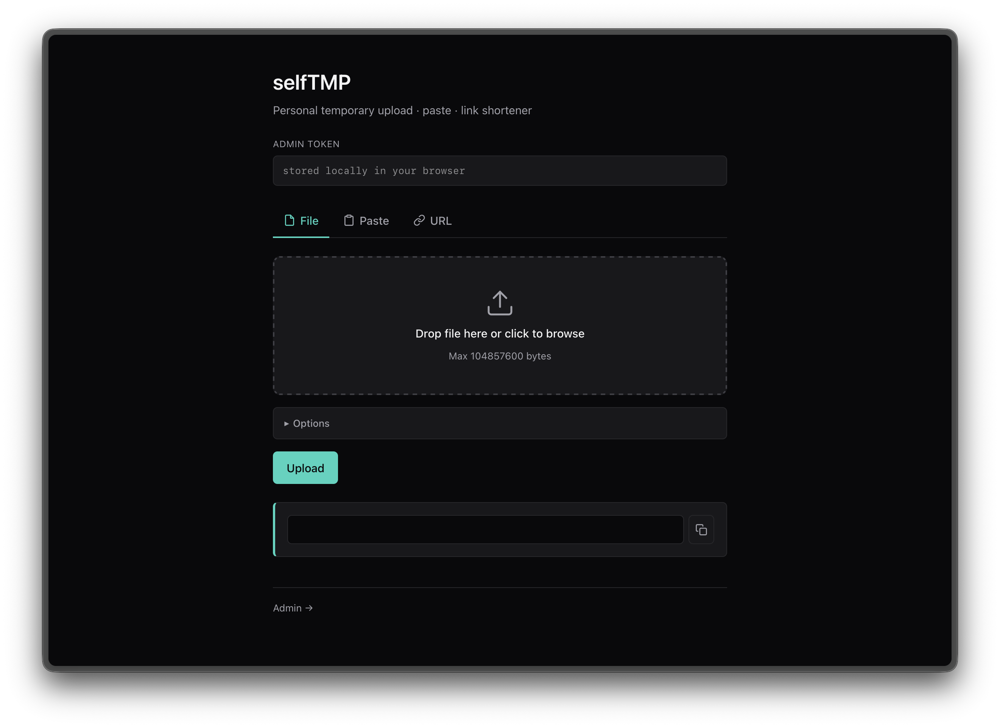

# selfTMP

A minimal, self-hosted service for temporary file, text, and URL sharing. Single Go binary, SQLite metadata, no external dependencies.

Think of it as a private, disposable pastebin + file drop + link shortener that you fully control — designed to be dropped behind a reverse proxy and forgotten.



---

## Features

- **Three content types in one endpoint** — upload files, share text pastes, or shorten URLs
- **Password protection** — bcrypt-hashed passwords, unlock persists via HMAC-signed cookie
- **One-time links** — auto-delete after the first successful access, atomically enforced
- **Expiring entries** — set a TTL (`1h`, `7d`, `never`, or any Go duration); a background janitor sweeps expired records every minute
- **Custom slugs** — pick your own short id, or let the server generate one
- **Admin dashboard** — list, inspect, and delete entries via a token-gated UI at `/admin`
- **Zero-dependency runtime** — pure Go SQLite (`modernc.org/sqlite`), templates and static assets embedded via `//go:embed`
- **Reverse-proxy aware** — respects `X-Forwarded-Proto` / `X-Forwarded-Host` when generating share links
- **Light + dark theme** — follows `prefers-color-scheme`

---

## Quick start

### Docker Compose (recommended)

```bash
cp .env.example .env
# edit .env and set ADMIN_TOKEN to a strong random value
docker compose up -d
```

Open <http://localhost:8080>.

### From source

Requires Go 1.25+. No CGO needed.

```bash
git clone https://github.com/YOUR_USER/selfTMP.git
cd selfTMP

# one-shot
ADMIN_TOKEN=dev-token go run .

# or load your .env
set -a && source .env && set +a
go run .
```

Data is written to `./data/` (SQLite DB + uploaded files). Delete the directory to reset state.

---

## Configuration

All configuration is via environment variables.

| Variable      | Required | Default        | Description                                                   |
| ------------- | -------- | -------------- | ------------------------------------------------------------- |
| `ADMIN_TOKEN` | yes      | —              | Bearer token required for all write operations and admin APIs |
| `PORT`        | no       | `8080`         | TCP port to listen on                                         |
| `DATA_DIR`    | no       | `./data`       | Directory for SQLite DB and uploaded files                    |
| `MAX_SIZE`    | no       | `104857600`    | Maximum upload size in bytes (default 100 MiB)                |
| `BASE_URL`    | no       | (from request) | External URL used in generated share links (behind a proxy)   |

---

## Usage

### Web UI

Visit `/` for the upload / paste / shorten form. Your admin token is stored in `localStorage` after first use.

Visit `/admin` for the management dashboard — list all live entries, view metadata, and delete individual items.

### HTTP API

All write endpoints require the admin token. Any of these authentication methods works:

- `X-Admin-Token: <token>` header
- `Authorization: Bearer <token>` header
- `?token=<token>` query string
- `token=<token>` form field

Responses are JSON when `Accept: application/json` is set (or when Accept doesn't include `text/html`).

#### Upload a file

```bash
curl -X POST http://localhost:8080/api/upload \
  -H "X-Admin-Token: $TOKEN" \
  -F "file=@./photo.jpg" \
  -F "expires_in=7d" \
  -F "one_time=1"
```

#### Create a paste

```bash
curl -X POST http://localhost:8080/api/paste \
  -H "X-Admin-Token: $TOKEN" \
  -d "content=hello world" \
  -d "password=s3cret" \
  -d "expires_in=1h"
```

#### Shorten a URL

```bash
curl -X POST http://localhost:8080/api/shorten \
  -H "X-Admin-Token: $TOKEN" \
  -d "url=https://example.com/very/long/path" \
  -d "custom_id=my-link"
```

#### Common form fields

| Field        | Applies to  | Description                                                              |
| ------------ | ----------- | ------------------------------------------------------------------------ |
| `custom_id`  | all         | Custom slug (`2-64` chars, `[A-Za-z0-9_-]`). Empty = random 6-char id    |
| `expires_in` | all         | `1h`, `30m`, `7d`, any Go duration, or `never` / `0` for no expiry       |
| `one_time`   | file, paste | `1` / `true` / `on` — entry is deleted after the first successful access |
| `password`   | file, paste | Sets a bcrypt password gate on the entry                                 |

### Retrieval

| Route               | Behavior                                                               |
| ------------------- | ---------------------------------------------------------------------- |
| `GET /{id}`         | Serves the entry — downloads file, renders paste, or 302-redirects URL |
| `GET /raw/{id}`     | Raw paste content as `text/plain`                                      |
| `POST /{id}/unlock` | Submits a password and sets an unlock cookie (1h grace window)         |

---

## Architecture

```
main.go                          entry point; embeds templates + static assets
internal/app/
  config.go                      env → Config
  server.go                      routing, logging, graceful shutdown
  handlers.go                    HTTP handlers for all endpoints
  db.go                          SQLite schema, Entry model, CRUD
  id.go                          slug validation, random id generation
  cleanup.go                     background janitor (sweeps expired every minute)
templates/                       HTML views (index, admin, paste, password)
static/                          CSS
data/                            runtime state (SQLite + uploads)
```

- **One table**: `entries` stores all three content types, distinguished by a `kind` column
- **Atomic one-time claim**: `UPDATE entries SET downloads = downloads + 1 WHERE id = ? AND (one_time = 0 OR downloads = 0)` — the affected-rows count decides whether the caller may serve the content
- **Password unlock cookie**: HMAC over `id|password_hash` signed with the admin token, so rotating the password immediately invalidates prior unlocks

---

## Development

```bash
# run with live reload
go install github.com/air-verse/air@latest
set -a && source .env && set +a
air

# static analysis + build
go vet ./...
go build ./...
```

Because templates and static files are compiled into the binary via `//go:embed`, edits to `templates/*.html` or `static/*` require a restart to take effect.

---

## Security notes

- Set `ADMIN_TOKEN` to a long random string. The server refuses to start without it.
- Token comparison uses `subtle.ConstantTimeCompare` to avoid timing leaks.
- Put the service behind TLS (nginx, Caddy, Traefik). Set `BASE_URL=https://...` so generated share links use the correct scheme and host.
- The admin dashboard shell (`/admin`) is public HTML; all data fetches on that page require the token.
- Uploaded files are stored on disk under `$DATA_DIR/files/<id>`; enforce filesystem-level backups or quotas as needed.

---

## License

BSD 3-Clause
